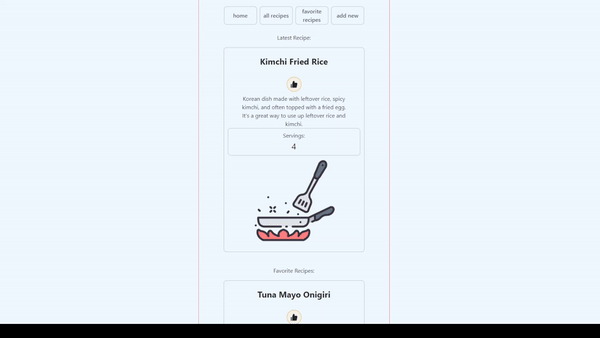

<h1 align="center" >Simple Recipe Book Application</h1>
<h4>This project is a web application that allows to create, view, and manage recipes and their corresponding notes. The frontend of the application is built using React, while the backend is developed with Django and Django REST Framework. The project is deployed on AWS using various services to ensure scalability, reliability, and performance.</h4>

<h3>Architecture</h3>
<ul>
    <li><em>Frontend</em>: The frontend is built with React and hosted on AWS S3. AWS CloudFront is used as a Content Delivery Network (CDN) to deliver the static files efficiently.</li>
    <li><em>Backend</em>: The backend is built with Django and Django REST Framework, hosted on AWS EC2. Nginx is used as a reverse proxy server, and Gunicorn is the WSGI server to serve the Django application. Supervisor is used to manage the processes.</li>
</ul>

<h3>Tech Stack</h3>

<table style="width:100%; border: 1px solid white; text-align:center">
<tr style="width:100%">
    <th style="text-align:center">Frontend</th>
    <th style="text-align:center">Backend</th>
</tr>
<tr style="text-align:center">
<td>React</td>
<td>Django</td>
</tr>
<tr style="text-align:center">
<td>AWS S3</td>
<td>Django REST Framework</td>
</tr>
<tr style="text-align:center">
<td>AWS CloudFront</td>
<td>AWS EC2</td>
</tr>
</tr>
<tr style="text-align:center">
<td></td>
<td>Nginx</td>
</tr>
</tr>
<tr style="text-align:center">
<td></td>
<td>Gunicorn</td>
</tr>
</tr>
<tr style="text-align:center">
<td></td>
<td>Supervisor</td>
</tr>

</table>

<h3>Features</h3>
<li>Mobile-first design</li>
<li>Create, Read, Update, Delete (CRUD) operations for recipes and notes</li>
<li>Like/Unlike recipes</li>
 

Screen Capture

<h3>Future Enhancements</h3>
<li>User Authentication</li>
<li>Responsive Design</li>
<li>Refactoring to TypeScript</li>
<li>Refactoring state management to use useContext and useReducer hooks</li>
<li>Efficient Content Delivery with AWS CloudFront</li>
 

Current CloudFront link:
<a target="_blank" href="http://d1dqkx2ygh51km.cloudfront.net/">Recipe Book</a>